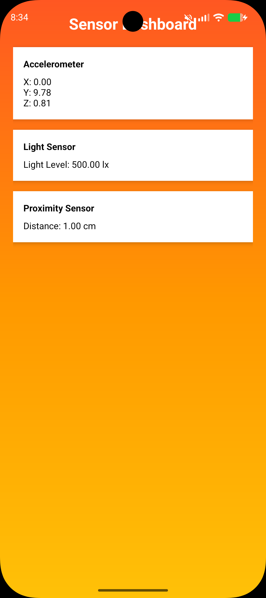

# 📱 Android Assignment Projects — Currency · Media · Sensors · Gallery

<div align="center">

📷 **Camera & Photo Gallery** · 🎬 **Audio & Video Player**
💱 **Currency Converter** · 📡 **Live Sensor Dashboard**
🚀 Built with Java · Designed for real Android devices.


---


A collection of **4 Android applications** built as part of a Mobile Application Development assignment, covering core Android concepts including UI design, media playback, hardware sensors, camera integration, and file management.

</div>

---

## 📂 Repository Structure

```
📦 root
 ┣ 📁 CurrencyConverter      → Q1: Multi-currency converter with Dark/Light theme
 ┣ 📁 MediaPlayer            → Q2: Audio & Video media player
 ┣ 📁 SensorApp              → Q3: Real-time hardware sensor dashboard
 ┣ 📁 PhotoGallery           → Q4: Camera + photo gallery with image management
 ┣ 📁 app                    → Root app module
 ┣ 📄 build.gradle.kts
 ┣ 📄 settings.gradle.kts
 └ 📄 README.md
```

---

## 🚀 Projects Overview

---

### 1. 💱 Currency Converter
> 

A clean and functional currency converter app supporting **4 major currencies** — INR, USD, JPY, and EUR — inspired by the Google Currency Converter UI.

**✨ Features:**
- Convert between INR 🇮🇳, USD 🇺🇸, JPY 🇯🇵, and EUR 🇪🇺
- Real-time conversion on input
- Settings page to toggle **Light ↔ Dark Theme**
- Smooth theme switching with persistent preference storage

**🛠️ Tech Used:**
- `SharedPreferences` for theme persistence
- `AppCompatDelegate` for Day/Night mode
- `Spinner` / `EditText` for currency input and selection

---

### 2. 🎬 Media Player
> 

A dual-mode media player that handles both **local audio files** and **streamed video from a URL**.

**✨ Features:**
- 🎵 Play audio files from device storage
- 🎥 Stream video from a remote URL
- Full playback controls: **Open File, Open URL, Play, Pause, Stop, Restart**
- Clean media control UI with progress tracking

**🛠️ Tech Used:**
- `MediaPlayer` API for audio playback
- `VideoView` + `MediaController` for video streaming
- `Intent.ACTION_GET_CONTENT` for file picker
- Runtime permission handling for storage access

---

### 3. 📡 Sensor App
> 

A real-time sensor monitoring dashboard that reads and displays live data from the device's built-in hardware sensors.

**✨ Features:**
- 📳 **Accelerometer** — X, Y, Z axis values
- 💡 **Light Sensor** — ambient light level in lux
- 📏 **Proximity Sensor** — near/far distance detection
- Live auto-updating values with clean card-based UI

**🛠️ Tech Used:**
- `SensorManager` and `SensorEventListener`
- `Sensor.TYPE_ACCELEROMETER`, `TYPE_LIGHT`, `TYPE_PROXIMITY`
- `onSensorChanged()` for real-time data updates
- Properly unregisters listener in `onPause()` to save battery

---

### 4. 🖼️ Photo Gallery
> 

A full-featured photo management app that integrates the device camera with a custom gallery browser and image management tools.

**✨ Features:**
- 📸 **Capture photos** using the on-device camera with runtime permission handling
- 📁 **Browse folders** on the device and select a folder to view
- 🗂️ **Grid gallery view** of all images in a folder (similar to a native Photo Gallery)
- 🔍 **Image Detail page** showing:
  - Image name, file path, size, and date taken
  - **Delete image** with confirmation `AlertDialog`
  - After deletion, automatically returns to the gallery view

**🛠️ Tech Used:**
- `CameraX` / `MediaStore` for camera capture
- `RecyclerView` + `GridLayoutManager` for photo grid
- `Glide` for efficient image loading and caching
- `AlertDialog` for delete confirmation
- `ActivityResultLauncher` for permission and camera result handling
- Runtime permissions: `CAMERA`, `READ_EXTERNAL_STORAGE` / `READ_MEDIA_IMAGES`

---

## ⚙️ Setup & Installation

### Prerequisites
- Android Studio **Hedgehog** or later
- Android SDK **API 24+** (Android 7.0 Nougat and above)
- A physical device or emulator with **API 24+**

### Steps to Run

```bash
# 1. Clone the repository
git clone https://github.com/sahilgit227/PhotoGallery.git

# 2. Open in Android Studio
File → Open → Select the project folder

# 3. Sync Gradle
Click "Sync Now" when prompted

# 4. Run the desired module
Select the app/module from the run configuration dropdown
Click ▶ Run
```

> ⚠️ For **SensorApp** and **PhotoGallery**, a **physical Android device** is recommended as emulators may not support all hardware sensors and camera features fully.

---

## 🔐 Permissions Used

| App | Permissions Required |
|---|---|
| CurrencyConverter | None |
| MediaPlayer | `READ_EXTERNAL_STORAGE` |
| SensorApp | None (hardware access via SensorManager) |
| PhotoGallery | `CAMERA`, `READ_MEDIA_IMAGES`, `WRITE_EXTERNAL_STORAGE` |

---

## 🧱 Tech Stack

| Category | Technology |
|---|---|
| Language | Java |
| IDE | Android Studio |
| Min SDK | API 24 (Android 7.0) |
| Target SDK | API 34 (Android 14) |
| Build System | Gradle (Kotlin DSL) |
| Image Loading | Glide |
| UI Components | RecyclerView, CardView, AlertDialog, VideoView |

---

## 📸 App Screenshots

---

### 💱 Currency Converter
<div align="center">
  
  
 
</div>

---

### 🎬 Media Player
<div align="center">
  
 
 
</div>

---

### 📡 Sensor Dashboard
<div align="center">
  
  
 
</div>

---

### 🖼️ Photo Gallery — All Screens

<div align="center">

| Home Screen | Choose Folder | Gallery Grid |
|:-----------:|:-------------:|:------------:|
|  |  |  |

| Image Details | | |
|:-------------:|---|---|
|  | | |

</div>

---

## 👨‍💻 Author

<div align="center">

**Sahil**
GitHub: [@sahilgit227](https://github.com/sahilgit227)

</div>

---

## 📄 License

This project is submitted as part of an academic assignment. All code is written for educational purposes.

---

<div align="center">

Made with ❤️ using Java & Android Studio

⭐ If you found this helpful, consider starring the repo!

</div>
